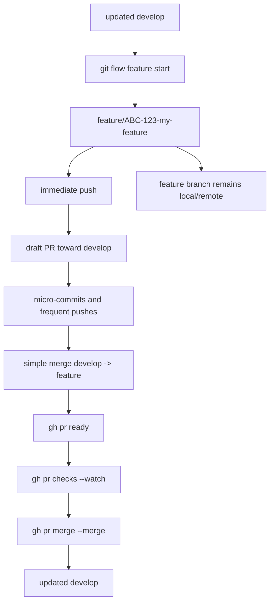
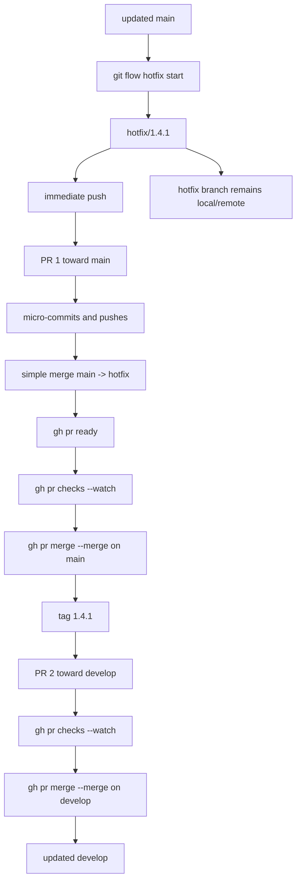
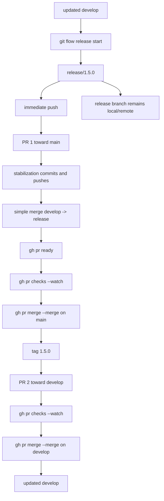
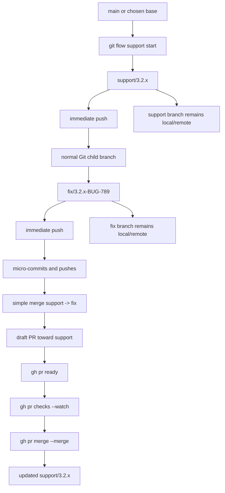
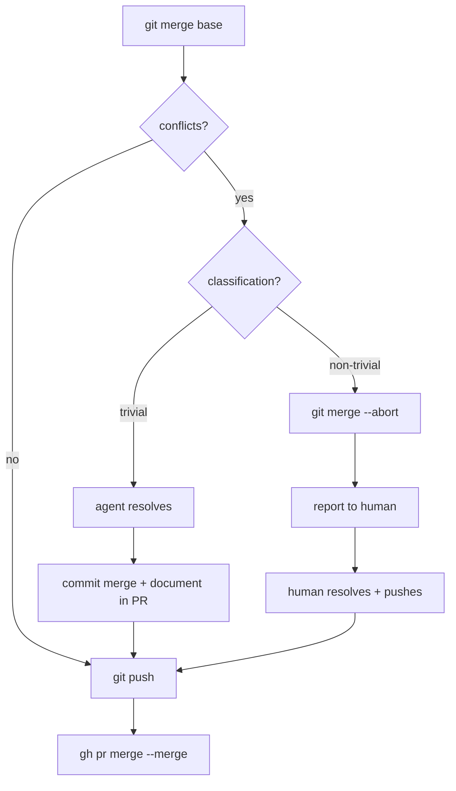

# Git Flow PR-Only Workflow (Terminal-Only, No Rebase, No Branch Deletion)

> Operational document for a **PR-only**, **terminal-only** workflow, with **simple merge of the base branch into the working branch before the PR**, **no rebase**, and **no branch deletion**.

---

## Index

- [1. Objective and assumptions](#1-objective-and-assumptions)
- [2. Tool installation](#2-tool-installation)
  - [2.1 Ubuntu 24.04](#21-ubuntu-2404)
  - [2.2 Rocky Linux 10](#22-rocky-linux-10)
  - [2.3 Installation verification and GitHub CLI login](#23-installation-verification-and-github-cli-login)
- [3. Global workflow rules](#3-global-workflow-rules)
- [4. Common synchronization rule before the PR](#4-common-synchronization-rule-before-the-pr)
- [5. Flow: Feature](#5-flow-feature)
- [6. Flow: Bugfix](#6-flow-bugfix)
- [7. Flow: Hotfix](#7-flow-hotfix)
- [8. Flow: Release](#8-flow-release)
- [9. Flow: Support](#9-flow-support)
- [10. Final operational summary](#10-final-operational-summary)
- [11. Conflict resolution](#11-conflict-resolution)
  - [11.1 Conflict classification](#111-conflict-classification)
  - [11.2 Scenario A — Single-PR flows (feature, bugfix)](#112-scenario-a--single-pr-flows-feature-bugfix)
  - [11.3 Scenario B — Two-PR flows (hotfix, release)](#113-scenario-b--two-pr-flows-hotfix-release)
- [12. Operational refinements](#12-operational-refinements)
  - [12.1 Always open a draft PR](#121-always-open-a-draft-pr)
  - [12.2 Explicit staging only](#122-explicit-staging-only)
  - [12.3 Branch deletion policy](#123-branch-deletion-policy)
- [13. Branch protection requirements](#13-branch-protection-requirements)
- [14. References](#14-references)

---

## 1. Objective and assumptions

Perfect. I will formalize it for you as a **PR-only, terminal-only, no rebase, no branch deletion** workflow, consistent with your constraints.

I assume:

- `main` as the production branch
- `develop` as the integration branch

If in the repository the production branch is still called `master`, simply replace `main` with `master`.

In **AVH Edition** the relevant operational "types" are:

- `feature`
- `bugfix`
- `release`
- `hotfix`
- `support`

The other subcommands (`init`, `config`, `log`, `version`) are utilities, not branch families. [^1]

The global rule of the process is this:

> **you use `git-flow` to open the right branch, push immediately, make micro-commits and frequent pushes, integrate the base branch with a simple merge before the PR, then merge the PR from the terminal with `gh`, without ever deleting the branch**.

In practice, this means that you **do not use `git flow ... finish`** in the day-to-day PR-only workflow:

- for `feature`, `release`, and `hotfix`, the classic documentation shows that `finish` merges locally and then removes the local branch; [^2] [^8] [^9]
- `gh pr merge` also has an explicit `--delete-branch` flag, which in this process **must not be used**. [^6]

If the **Automatically delete head branches** option is active on GitHub, it must be disabled at the repository level. [^12]

The choice is:

> **no rebase before the PR; only merge the base into the working branch**.

This is not the default shown by the `git-flow` documentation for features, which shows `rebase`, but it is entirely feasible with standard Git via `git merge`. For releases, the classic documentation explicitly shows `git merge develop` as the simple case for realigning the release branch. [^2] [^3] [^9]

> **Additional operational assumption**
>
> This document assumes that **merge commit** is enabled for pull requests on the GitHub repository, because the merge commands below use `gh pr merge --merge`. GitHub CLI supports `--merge`, `--rebase`, and `--squash`; here `--merge` is deliberately used because you requested a flow based on simple merges and not on rebase/squash. [^6]

---

## 2. Tool installation

The minimum required tools are:

- `git`
- `git-flow` (AVH Edition / `git-flow` package where available)
- `gh` (GitHub CLI)

---

### 2.1 Ubuntu 24.04

On Ubuntu 24.04 (`noble`) the `git`, `git-flow`, and `gh` packages are available in the Ubuntu repository. [^13] [^14] [^15]

#### Installation

```bash
# Update the APT package index so repository metadata is current.
sudo apt update

# Install Git, required for all version-control operations.
sudo apt install -y git

# Install git-flow from the Ubuntu 24.04 repository.
# It is needed for the "git flow feature|bugfix|release|hotfix|support ..." commands.
sudo apt install -y git-flow

# Install GitHub CLI from the Ubuntu 24.04 repository.
# It is needed to create, inspect, and merge PRs from the terminal.
sudo apt install -y gh
```

#### Why each command is executed

- `sudo apt update`  
  It updates the local APT package index. Without this step you risk installing with stale metadata or not seeing versions available in the repository.

- `sudo apt install -y git`  
  It installs Git, the indispensable base of the workflow.

- `sudo apt install -y git-flow`  
  It installs the `git-flow` extension, which on Ubuntu 24.04 is published as the `git-flow` package. [^14]

- `sudo apt install -y gh`  
  It installs GitHub CLI, which on Ubuntu 24.04 is published as the `gh` package. [^15]

#### Operational notes

- If you want to stick **strictly** to the distribution package, the commands above are enough.
- If instead you always want the latest build of `gh`, you can also use the official GitHub CLI repository; in this document, however, we keep the more direct and native path for Ubuntu 24.04, since `gh` is already present in the Ubuntu repository. [^15]

---

### 2.2 Rocky Linux 10

On Rocky Linux 10 the standard package manager is `dnf`. [^16]  
For `gh`, the Rocky documentation shows installation by adding the official GitHub CLI repository and then using `dnf install gh`. [^17]

For `git-flow`, the most reliable and AVH-Edition-consistent path, in the absence of a Rocky package explicitly documented here, is to install it from upstream AVH with `make install`, which is the method documented in the AVH repository. [^18]

#### Installation

```bash
# Update the DNF repository metadata.
sudo dnf makecache

# Install Git, Make, and Curl.
# - git is needed for version control and for cloning the AVH git-flow repository
# - make is needed for "make install"
# - curl is needed to download/set up the gh repository
sudo dnf install -y git make curl
```

```bash
# Add the official GitHub CLI RPM repository to the DNF configuration.
# This way Rocky will know where to download the "gh" package from.
curl -fsSL https://cli.github.com/packages/rpm/gh-cli.repo | sudo tee /etc/yum.repos.d/github-cli.repo > /dev/null

# Install GitHub CLI from the official repository just configured.
sudo dnf install -y gh
```

```bash
# Clone the AVH Edition git-flow repository locally.
git clone https://github.com/petervanderdoes/gitflow-avh.git

# Enter the directory of the repository just cloned.
cd gitflow-avh

# Install git-flow into the system using the Makefile target provided by the project.
sudo make install

# Go back to the previous directory.
cd ..
```

```bash
# Optional: remove the local copy of the repository used only for installation.
rm -rf gitflow-avh
```

#### Why each command is executed

- `sudo dnf makecache`  
  It updates the DNF repository cache, conceptually equivalent to `apt update`.

- `sudo dnf install -y git make curl`  
  It installs:
  - `git`, for version control and for cloning the AVH upstream;
  - `make`, required for `make install`;
  - `curl`, used to configure the `gh` repository.

- `curl -fsSL https://cli.github.com/packages/rpm/gh-cli.repo | sudo tee /etc/yum.repos.d/github-cli.repo > /dev/null`  
  It writes the official GitHub CLI RPM repository file under `/etc/yum.repos.d/`, so `dnf` can install `gh` from the correct repository. The procedure matches the one documented by Rocky Linux. [^17]

- `sudo dnf install -y gh`  
  It installs GitHub CLI.

- `git clone https://github.com/petervanderdoes/gitflow-avh.git`  
  It clones the AVH Edition repository.

- `cd gitflow-avh`  
  It enters the project directory because `make install` must be executed there.

- `sudo make install`  
  It installs the `git-flow` scripts into the system. The AVH repository explicitly documents `make && make install` as the installation method. [^18]

- `cd ..`  
  It goes back after installation.

- `rm -rf gitflow-avh`  
  It removes the local source copy if you do not want to keep it. It is optional.

---

### 2.3 Installation verification and GitHub CLI login

After installation, it is worth immediately checking that the tools are present and authenticating `gh`.

```bash
# Verify that Git is installed and show the version.
git --version

# Verify that git-flow is installed.
git flow version || git flow init -h

# Verify that GitHub CLI is installed and show the version.
gh --version
```

```bash
# Start the interactive GitHub CLI login.
# It is needed to authorize PR/issue/repo commands from the terminal.
gh auth login
```

#### Why each command is executed

- `git --version`  
  Immediate verification that `git` is reachable in the `PATH`.

- `git flow version || git flow init -h`  
  Depending on the build/installation, support for `git flow version` may not be uniform; the fallback `git flow init -h` simply serves to verify that the `git flow` command exists and responds.

- `gh --version`  
  It verifies the presence of `gh`.

- `gh auth login`  
  GitHub CLI documents `gh auth login` as the standard authentication command. [^19]

---

## 3. Global workflow rules

The invariants of this process are:

- immediate push of the branch as soon as it is created;
- **always open a draft PR** immediately after branch creation;
- micro-commits and frequent pushes;
- **stage files explicitly** (`git add <file> ...`), never use `git add -A`;
- **never rebase** before the PR;
- **always simple merge of the base into the working branch**;
- merge the PR from the terminal with `gh`;
- **agents never delete branches** (human operator may prune manually).

### Commands forbidden in this workflow

```bash
# DO NOT use "finish" on topic branches in the day-to-day PR-only workflow:
# - feature finish
# - bugfix finish
# - hotfix finish
# - release finish
# because these commands belong to the classic git-flow process, not to your PR-only flow.
git flow feature finish <name>
git flow bugfix finish <name>
git flow hotfix finish <release>
git flow release finish <release>

# DO NOT use the flag that automatically deletes the local and remote branch after merge.
gh pr merge --delete-branch

# DO NOT use blanket staging commands — always stage files explicitly by name.
git add -A
git add .
```

### Why these commands are forbidden

- `git flow ... finish`
  In the classic flow, `finish` performs local merges and branch cleanup; this conflicts with the requirement that branches must always remain. [^2] [^8] [^9]

- `gh pr merge --delete-branch`
  It deletes the local and remote branch after merge. This is explicitly contrary to the process rule. [^6]

- `git add -A` / `git add .`
  Blanket staging can pick up `.env` files, secrets, editor temp files, large binaries, or other artifacts that should not enter version control. Always stage files explicitly by name.

### GitHub setting to verify

If you do not want GitHub to automatically delete the head branch after the PR is merged:

1. open the repository on GitHub;
2. go to **Settings**;
3. go to the **Pull Requests** section;
4. disable **Automatically delete head branches**. [^12]

---

## 4. Common synchronization rule before the PR

For every "topic" branch targeting a base, the pre-PR sequence in your process is always this:

1. update the base;
2. go back to the working branch;
3. do a **simple merge** of the base into the branch;
4. resolve any conflicts;
5. push.

`git merge` is the standard Git command for this step. [^3]

```bash
# Go to the base branch, that is, the one you will open the PR against.
git checkout <base>

# Align the local base branch with the remote using fast-forward only.
# This avoids creating local merge commits while you are only synchronizing.
git pull --ff-only origin <base>

# Go back to the working branch (feature/bugfix/hotfix/release/support-child).
git checkout <topic-branch>

# Merge the updated base into the working branch.
# This is the key point of your workflow: NO rebase, YES simple merge.
git merge <base>

# Publish the merge result to the remote.
git push
```

### Why each command is executed

- `git checkout <base>`  
  It puts you on the correct reference branch.

- `git pull --ff-only origin <base>`  
  It updates the base branch without introducing artificial merge commits.

- `git checkout <topic-branch>`  
  It returns you to the working branch.

- `git merge <base>`  
  It integrates the latest version of the base into the working branch. This is the behavior required by the process.

- `git push`  
  It publishes the merge to the remote, so the PR reflects the exact current state of the branch.

---

## 5. Flow: Feature

In AVH, `feature` is born from `develop` by default through `git flow feature start <name> [<base>]`. In the classic workflow, `feature finish` merges into `develop` and deletes the branch; in your process, instead, closure happens **only through PR**. [^4]

### Full flow

```bash
# Go to develop because a feature is born from the integration branch.
git checkout develop

# Update develop from the remote before opening a new feature branch.
git pull --ff-only origin develop

# Create the feature branch starting from develop.
# With AVH the real name will be feature/ABC-123-my-feature.
git flow feature start ABC-123-my-feature

# Immediately publish the remote branch and set upstream tracking.
# This satisfies the requirement "I create the feature branch, I immediately push it".
git push -u origin feature/ABC-123-my-feature
```

### Why each command is executed

- `git checkout develop`  
  Because the natural base of a feature is `develop`.

- `git pull --ff-only origin develop`  
  To start from a state aligned with the remote.

- `git flow feature start ABC-123-my-feature`  
  To create the `feature/...` branch consistently using the git-flow AVH convention. [^4]

- `git push -u origin feature/ABC-123-my-feature`  
  To publish the branch immediately and configure remote tracking.

### Immediate draft PR

Always open a **draft PR** immediately after creating and pushing the branch. Do not attempt to predict whether the feature will be long or short. `gh pr create` supports `--base`, `--head`, `--draft`, and `--fill`, while `gh pr ready` later marks it as ready for review. [^5] [^20]

```bash
# Create a draft pull request toward develop.
# --base develop  => PR target
# --head feature/... => source branch of the PR
# --draft         => the PR starts as a draft
# --fill          => use commit/title/body data to prefill
gh pr create \
  --base develop \
  --head feature/ABC-123-my-feature \
  --draft \
  --fill
```

### Day-to-day work

```bash
# Stage the modified files explicitly by name.
git add src/feature-x.py tests/test_feature_x.py

# Create a local micro-commit with a descriptive message.
git commit -m "Implement X"

# Immediately publish the commit to the remote.
# This is consistent with the requirement "micro-commit and push at least by end of day".
git push
```

### Realignment before the final review/PR

Before the final review/PR, in your process you do a **simple `develop -> feature/...` merge**, not a rebase. [^3]

```bash
# Go back to develop to update the base.
git checkout develop

# Update the develop base from the remote.
git pull --ff-only origin develop

# Go back to the feature branch you want to send to review.
git checkout feature/ABC-123-my-feature

# Merge develop into feature.
# This is the behavior required by your process: NO rebase, YES simple merge.
git merge develop

# Publish the merge to the remote so the PR also includes the latest realignment.
git push
```

### When the feature is ready

```bash
# Mark the draft PR as ready for review.
gh pr ready

# Show the current PR with comments.
# Useful to read review, threads, and general status without leaving the terminal.
gh pr view --comments

# Monitor the current PR CI checks until completion.
gh pr checks --watch

# Perform the server-side merge with a merge commit.
# DO NOT use --delete-branch.
gh pr merge --merge
```

`gh pr checks --watch` monitors CI checks until completion; `gh pr merge --merge` performs a server-side merge commit. Do not use `--delete-branch`. [^6] [^21]

### After the merge

```bash
# Go back to develop after the PR has been merged.
git checkout develop

# Update the local develop with what has just been merged server-side.
git pull --ff-only origin develop
```

And **that is it**. The `feature/...` branch remains both local and remote.

### Mermaid diagram



---

## 6. Flow: Bugfix

In AVH, `bugfix` is a separate family from `feature`; `git flow bugfix start <name> [<base>]` starts by default from `develop`. Here too AVH exposes a `finish` command, but in your process you ignore it and close everything through PR. [^7]

### Full flow

```bash
# Go to develop because, in this process, the standard bugfix also starts from the integration branch.
git checkout develop

# Update develop from the remote.
git pull --ff-only origin develop

# Create the bugfix branch starting from develop.
git flow bugfix start BUG-456-fix-null-pointer

# Immediately publish the remote branch and set upstream tracking.
git push -u origin bugfix/BUG-456-fix-null-pointer
```

### Immediate draft PR

Always open a draft PR immediately after creating and pushing the branch.

```bash
# Create a draft PR for the bugfix toward develop.
gh pr create \
  --base develop \
  --head bugfix/BUG-456-fix-null-pointer \
  --draft \
  --fill
```

### Day-to-day work

```bash
# Stage the modified files explicitly by name.
git add src/parser.py tests/test_parser.py

# Atomic commit of the fix or part of it.
git commit -m "Fix null dereference in parser"

# Push the commit to the remote.
git push
```

### Before the PR: simple merge of the base

```bash
# Update the develop base branch.
git checkout develop
git pull --ff-only origin develop

# Go back to the bugfix.
git checkout bugfix/BUG-456-fix-null-pointer

# Integrate the latest develop into the bugfix branch.
git merge develop

# Publish the merge to the remote.
git push
```

### Closure

```bash
# Mark the PR as ready for review.
gh pr ready

# View the PR with comments.
gh pr view --comments

# Watch CI checks until the end.
gh pr checks --watch

# Perform the PR merge commit.
gh pr merge --merge
```

### Post-merge

```bash
# Go back to develop after the PR merge.
git checkout develop

# Synchronize local develop with the remote.
git pull --ff-only origin develop
```

Operationally, in your process `bugfix` is the same as `feature`; only the semantics of the branch name change, and the fact that AVH distinguishes it natively. [^7]

### Mermaid diagram


---

## 7. Flow: Hotfix

The classic `git-flow` documentation defines `hotfix` as a branch to quickly fix the **latest stable release**; it is born from the production branch (`master` in the classic documentation, to be read as your `main` if you configured it that way) and, in the classic flow, `hotfix finish` merges both into the production branch and into `develop`, creates the tag, and then removes the local branch. In a PR-only workflow, the natural translation is: **same branch, two PRs, plus explicit tag**. [^8]

### Full flow

```bash
# Go to main because the hotfix is born from the production branch.
git checkout main

# Update main from the remote before creating the hotfix.
git pull --ff-only origin main

# Create the hotfix branch starting from main.
git flow hotfix start 1.4.1

# Immediately publish the remote branch and set upstream tracking.
git push -u origin hotfix/1.4.1
```

### Immediate draft PR

Always open a draft PR immediately after creating and pushing the branch. For hotfix, the first PR targets main.

```bash
# Create a draft PR for the hotfix toward main.
gh pr create \
  --base main \
  --head hotfix/1.4.1 \
  --draft \
  --fill
```

### Day-to-day work

```bash
# Stage the modified files explicitly by name.
git add src/payment.py tests/test_payment.py

# Commit the urgent production fix.
git commit -m "Fix production regression in payment flow"

# Push the commit to the remote.
git push
```

### If `main` moved: simple `main -> hotfix` merge

The classic documentation shows rename + rebase; since you excluded rebase, here we standardize a **simple `main -> hotfix/...` merge** before the PR. It is a workflow customization, but perfectly compatible with Git. [^3] [^8]

```bash
# Update main from the remote.
git checkout main
git pull --ff-only origin main

# Go back to the hotfix branch.
git checkout hotfix/1.4.1

# Integrate the latest main into the hotfix with a simple merge.
git merge main

# Publish the merge to the remote.
git push
```

### PR 1: hotfix toward production

When the hotfix is ready (draft PR was already created immediately after branch creation):

```bash
# Mark the PR toward main as ready.
gh pr ready

# Wait for CI checks to complete.
gh pr checks --watch

# Perform the merge commit of the PR toward main.
gh pr merge --merge
```

### Tag of the hotfix release

In the classic flow, `hotfix finish` also creates the version tag; in PR-only, the cleanest point is to create the tag **after** the PR toward `main` has been merged. [^8]

```bash
# Go back to main after the PR toward production has been merged.
git checkout main

# Update local main to make sure you tag the correct commit.
git pull --ff-only origin main

# Create an annotated tag for the hotfix version.
git tag -a 1.4.1 -m "Hotfix 1.4.1"

# Publish the tag to the remote.
git push origin 1.4.1
```

### PR 2: same hotfix toward `develop`

Since the classic `hotfix finish` flow brings the changes both to production and to `develop`, in PR-only you open a second PR from the same hotfix branch toward `develop`. [^8]

```bash
# Create the second PR from the same hotfix branch, this time toward develop.
gh pr create \
  --base develop \
  --head hotfix/1.4.1 \
  --fill
```

```bash
# Wait for the CI checks of the PR toward develop.
gh pr checks --watch

# Merge the PR toward develop.
gh pr merge --merge
```

Finally:

```bash
# Go back to develop after the second PR has also been merged.
git checkout develop

# Update local develop with the merge that just happened server-side.
git pull --ff-only origin develop
```

So, in your process, the hotfix is: **start from `main`, immediate push, merge `main -> hotfix` before the PR if needed, PR on `main`, tag, PR on `develop`, no deletion**.

### Mermaid diagram



---

## 8. Flow: Release

The classic documentation says that `release` is born from `develop`, is used to prepare a new major/minor version, and `release finish` does four things: merge into production, create the tag, merge into `develop`, remove the local branch. Here too, in PR-only, the correct form is **two PRs + manual tag**, without using `finish`. The same documentation also says that the release branch should be fairly short and lightweight, and shows `git merge develop` as the simple case to update it. [^9]

### Full flow

```bash
# Go to develop because a release is born from the integration branch.
git checkout develop

# Update develop from the remote.
git pull --ff-only origin develop

# Create the release branch starting from develop.
git flow release start 1.5.0

# Immediately publish the remote branch and set upstream tracking.
git push -u origin release/1.5.0
```

### Immediate draft PR

Always open a draft PR immediately after creating and pushing the branch. For release, the first PR targets main.

```bash
# Create a draft PR for the release toward main.
gh pr create \
  --base main \
  --head release/1.5.0 \
  --draft \
  --fill
```

### Typical work on a release

```bash
# Stage the release stabilization changes explicitly by name.
git add VERSION setup.cfg CHANGELOG.md

# Typical release commit, for example a version bump.
git commit -m "Bump version to 1.5.0"

# Publish the commit to the remote.
git push
```

### If during stabilization you want to realign it with `develop` without rebase

The standard pre-PR is compatible here too; in addition, for the release, the classic documentation explicitly shows `git merge develop` as the simple case. [^9]

```bash
# Update develop from the remote.
git checkout develop
git pull --ff-only origin develop

# Go back to the release branch.
git checkout release/1.5.0

# Integrate the latest develop into the release with a simple merge.
git merge develop

# Publish the merge to the remote.
git push
```

### PR 1: release toward production

When the release is ready (draft PR was already created immediately after branch creation):

```bash
# Mark the release->main PR as ready for review.
gh pr ready

# Wait for CI checks to finish.
gh pr checks --watch

# Perform the merge commit of the PR toward main.
gh pr merge --merge
```

### Release tag

In the classic flow `release finish` creates the version tag. In PR-only, doing it immediately after the PR toward `main` is merged is the cleanest point. [^9]

```bash
# Go back to main after the release PR is merged.
git checkout main

# Update local main so the tag points to the correct commit already present on the server.
git pull --ff-only origin main

# Create the annotated release tag.
git tag -a 1.5.0 -m "Release 1.5.0"

# Publish the tag to the remote.
git push origin 1.5.0
```

### PR 2: same release toward `develop`

Since the classic flow also brings the release into `develop`, open a second PR from the same release branch toward `develop`. [^9]

```bash
# Create a second PR from the same release branch toward develop.
gh pr create \
  --base develop \
  --head release/1.5.0 \
  --fill
```

```bash
# Wait for the CI checks of the PR toward develop.
gh pr checks --watch

# Perform the merge commit of the PR toward develop.
gh pr merge --merge
```

Finally:

```bash
# Go back to develop after the second PR is merged.
git checkout develop

# Update local develop.
git pull --ff-only origin develop
```

So, for you, the release is: **start from `develop`, immediate push, small stabilization commits, merge `develop -> release` if needed, PR on `main`, tag, PR on `develop`, no deletion**.

### Mermaid diagram



---

## 9. Flow: Support

Yes: **`support` also exists**. But here an important clarification is needed: in the public AVH Edition, `support` is the most incomplete/least polished part. Public issues show that `git flow support start` explicitly requires `<version> <base>`, that there is no `support publish`, and that there is no `support finish` analogous to `hotfix finish`. For this reason, in practice, I would use it **only to create the maintenance line**, and then I would use **normal Git** for child branches targeting that line. [^10] [^11]

### What it represents

`support/3.2.x` or similar is a **long-lived maintenance line** for an old major/minor/LTS.

### Opening the support line

```bash
# Go to main (or to the correct base that should originate the support line).
git checkout main

# Update the base branch from the remote.
git pull --ff-only origin main

# Create the support line.
# WARNING: support explicitly requires <release> and <base>.
git flow support start 3.2.x <base>

# Immediately publish the support line to the remote.
git push -u origin support/3.2.x
```

The public trail is clear that `support start` requires an explicit `<base>`; moreover, a public issue shows that `support publish` does not exist, so you do the push with normal Git. [^10]

### How to actually work on it

Here I would not insist on `git flow` for child branches. I would treat `support/3.2.x` as a maintenance trunk, and open normal Git branches on top of it:

```bash
# Go to the support line.
git checkout support/3.2.x

# Update the support line from the remote.
git pull --ff-only origin support/3.2.x

# Create a normal Git child branch on top of the support line.
git switch -c fix/3.2.x-BUG-789

# Immediately publish the child remote branch.
git push -u origin fix/3.2.x-BUG-789
```

### Immediate draft PR

Always open a draft PR immediately after creating and pushing the child branch.

```bash
# Create a draft PR toward the support line.
gh pr create \
  --base support/3.2.x \
  --head fix/3.2.x-BUG-789 \
  --draft \
  --fill
```

### Day-to-day work

```bash
# Stage the modified files explicitly by name.
git add src/legacy_module.py tests/test_legacy.py

# Commit the fix.
git commit -m "Fix issue on 3.2.x line"

# Push the commit to the remote.
git push
```

### Before the PR: simple merge of the base into the working branch

```bash
# Update the support line from the remote.
git checkout support/3.2.x
git pull --ff-only origin support/3.2.x

# Go back to the child working branch.
git checkout fix/3.2.x-BUG-789

# Integrate the latest support line into the working branch.
git merge support/3.2.x

# Publish the merge to the remote.
git push
```

### PR toward the support line

When the fix is ready (draft PR was already created immediately after branch creation):

```bash
# Mark the PR as ready.
gh pr ready

# Monitor CI checks.
gh pr checks --watch

# Perform the merge commit of the PR toward support/3.2.x.
gh pr merge --merge
```

Realistically, this is the most robust form for `support` in your process, precisely because the `support` family in AVH does not have the same operational completeness as `feature`/`bugfix`/`release`/`hotfix`. [^10] [^11]

### Mermaid diagram



---

## 10. Final operational summary

For your specific case, the correct normalization is this:

- **feature**: `develop -> feature/... -> PR on develop`
- **bugfix**: `develop -> bugfix/... -> PR on develop`
- **hotfix**: `main -> hotfix/... -> PR on main -> tag -> PR on develop`
- **release**: `develop -> release/... -> PR on main -> tag -> PR on develop`
- **support**: `git flow support start ...`, then child branches with normal Git and PR toward `support/...` [^4]

And your invariants always remain identical:

- immediate push of the branch as soon as it is created;
- micro-commit + push at least by end of day;
- **never rebase** before the PR;
- **always simple merge of the base into the working branch**;
- merge the PR from the terminal with `gh`;
- **agents never delete branches** (human operator may prune manually);
- **always open a draft PR** immediately after branch creation;
- **stage files explicitly** (`git add <file> ...`), never use `git add -A`. [^5]

---

## 11. Conflict resolution

Conflicts in this workflow can only surface during the synchronization merge (base into topic branch), never during the PR merge itself. The PR merge MUST be conflict-free. If it is not, the agent MUST re-run the synchronization step before attempting the merge again.

### 11.1 Conflict classification

When a `git merge <base>` produces conflicts on the topic branch, they are classified as either **trivial** or **non-trivial**:

| Classification | Definition | Who resolves |
|---------------|------------|--------------|
| **Trivial** | Only one side has semantic changes (the other is whitespace, formatting, or context drift). Also: conflicts in generated files (`PLAN.md`, `PLAN.dot`) that will be regenerated. | Agent resolves |
| **Non-trivial** | Both sides modified the same logical block, or the conflict is in governance/authority files, or the agent is not confident in the resolution. | Agent escalates to human |

Regardless of who resolves, every conflict resolution MUST be reported in the PR description or as a PR comment, listing:
- the files affected,
- which hunks conflicted,
- the resolution strategy used (agent-trivial or human-resolved).

### 11.2 Scenario A — Single-PR flows (feature, bugfix)

This scenario applies to feature and bugfix branches, which target develop with a single PR.

```bash
# 1. Update the base branch.
git checkout develop
git pull --ff-only origin develop

# 2. Switch to the topic branch.
git checkout feature/X

# 3. Merge the base into the topic branch — conflicts surface here.
git merge develop
```

**If no conflicts:** continue to step 4.

**If conflicts at step 3:**

- **Trivial:** agent resolves, commits the merge, and documents the resolution in the PR description.
- **Non-trivial:** agent aborts the merge (`git merge --abort`), reports the conflicting files and hunks to the human, and waits for human resolution. After the human resolves and pushes, the agent resumes from step 4.

```bash
# 4. Push the conflict-free branch.
git push

# 5. Mark the draft PR as ready for review (if still in draft).
gh pr ready

# 6. Wait for CI checks to pass.
gh pr checks --watch

# 7. Merge the PR — guaranteed conflict-free.
gh pr merge --merge

# 8. Update the local base branch.
git checkout develop
git pull --ff-only origin develop
```

**Invariant:** the PR merge at step 7 MUST be conflict-free because step 3 already incorporated all of develop's state into the topic branch. If develop moved again between step 4 and step 7 causing new conflicts, repeat from step 1.

### 11.3 Scenario B — Two-PR flows (hotfix, release)

This scenario applies to hotfix and release branches, which require two PRs: one toward main (PR1) and one back-merge toward develop (PR2).

#### PR1: hotfix/release toward main

```bash
# 1. Update the production branch.
git checkout main
git pull --ff-only origin main

# 2. Switch to the hotfix/release branch.
git checkout hotfix/1.4.1

# 3. Merge the base into the topic branch — conflicts surface here.
git merge main
```

**If no conflicts:** continue.

**If conflicts at step 3:** same trivial/non-trivial rules as Scenario A.

```bash
# 4. Push the conflict-free branch.
git push

# 5. Mark the draft PR as ready for review (if still in draft).
gh pr ready

# 6. Wait for CI checks to pass.
gh pr checks --watch

# 7. Merge the PR toward main.
gh pr merge --merge
```

#### Tag (hotfix and release only)

```bash
# 8. Update local main to tag the correct commit.
git checkout main
git pull --ff-only origin main

# 9. Create the annotated tag.
git tag -a 1.4.1 -m "Hotfix 1.4.1"

# 10. Publish the tag.
git push origin 1.4.1
```

#### PR2: hotfix/release back-merge

**Before opening PR2, determine the back-merge target:**

- If a release branch currently exists (`release/*`), the back-merge targets that release branch instead of develop. The release branch will eventually carry the hotfix into develop when it is itself merged, avoiding duplicate merge commits and double-conflict resolution.
- If no release branch exists, the back-merge targets develop.

Let `<target>` be `release/X.Y.Z` or `develop` accordingly.

```bash
# 11. Update the back-merge target.
git checkout <target>
git pull --ff-only origin <target>

# 12. Switch to the hotfix/release branch.
git checkout hotfix/1.4.1

# 13. Merge the target into the hotfix/release branch — conflicts surface here.
git merge <target>
```

**If no conflicts:** continue.

**If conflicts at step 13:** same trivial/non-trivial rules as Scenario A. Agent resolves trivial, escalates non-trivial. Every resolution is reported in the PR2 description.

```bash
# 14. Push the conflict-free branch.
git push

# 15. Create the PR toward the back-merge target.
gh pr create --base <target> --head hotfix/1.4.1 --fill
# (or gh pr ready if a draft PR already exists for this target)

# 16. Wait for CI checks to pass.
gh pr checks --watch

# 17. Merge the PR toward the back-merge target.
gh pr merge --merge

# 18. Update the local target branch.
git checkout <target>
git pull --ff-only origin <target>
```

**Invariant:** the tag (steps 8–10) is unaffected by PR2 conflicts — it points to the main-branch commit, which is already safe.

#### Mermaid diagram — conflict resolution decision



---

## 12. Operational refinements

### 12.1 Always open a draft PR

A draft PR MUST be opened immediately after the branch is created and pushed, for every branch type. Do not attempt to predict whether a feature will be "long" or "short."

**Rationale:** a draft PR provides immediate visibility, enables CI from the first push, and costs nothing. The `gh pr ready` command marks it as ready for review when the work is complete.

```bash
# Immediately after git push -u origin <branch>:
gh pr create \
  --base <target> \
  --head <branch> \
  --draft \
  --fill
```

### 12.2 Explicit staging only

Never use `git add -A` or `git add .` to stage changes. Always stage files explicitly by name:

```bash
# Correct:
git add src/parser.py tests/test_parser.py

# Forbidden:
git add -A
git add .
```

**Rationale:** `git add -A` can pick up `.env` files, secrets, editor temp files, large binaries, or other artifacts that should not enter version control. Explicit staging ensures every committed file is intentional.

### 12.3 Branch deletion policy

- **Agents MUST NOT delete branches** — neither local nor remote, neither topic branches nor long-lived branches.
- **The human operator MAY manually prune** old merged branches when appropriate.
- The GitHub repository setting **Automatically delete head branches** MUST remain disabled. [^12]

---

## 13. Branch protection enforcement

GitHub's server-side branch protection rules require a paid plan (Team or Enterprise) for private repositories. This workflow enforces branch protection through two layers that work on any GitHub plan.

### 13.1 Layer 1 — Local git hooks

A `pre-push` hook prevents direct pushes to protected branches. It is installed as part of repository bootstrap and lives in `.githooks/` within the repository.

```bash
#!/usr/bin/env bash
# .githooks/pre-push
# Prevents direct pushes to protected branches.
# Install: git config core.hooksPath .githooks

protected_branches="main develop"
current_branch=$(git rev-parse --abbrev-ref HEAD)

for branch in $protected_branches; do
  if [ "$current_branch" = "$branch" ]; then
    echo "ERROR: Direct push to '$branch' is forbidden."
    echo "Use a topic branch and open a PR instead."
    exit 1
  fi
done
```

**Installation:** `git config core.hooksPath .githooks` — this SHOULD be part of `bootstrap-repo.sh` for every governed repository.

**Limitation:** local hooks are client-side. A human can bypass them with `--no-verify`. In a small disciplined team this is acceptable — the hook prevents accidents, not malice.

### 13.2 Layer 2 — Agent governance

Agents operating under this workflow follow the governance rules in `AGENTS.md` and the canonical workflow authorities. The `gitflow-pr-only` skill enforces the full PR-based flow procedurally. Agents MUST NOT push directly to `main` or `develop` under any circumstances.

### 13.3 Deferred — GitHub Actions enforcement

Server-side enforcement via GitHub Actions (branch guard on direct pushes, PR validation workflows) is deferred to a future milestone. When implemented, Actions will provide:

- detection and alerting on direct pushes to protected branches,
- PR validation rules (branch naming convention, target branch correctness),
- status check enforcement.

GitHub Actions are free for public repositories and included in the Free plan for private repositories (2000 minutes/month), so no plan upgrade is needed when this layer is activated.

### 13.4 Branch protection principles

Regardless of enforcement layer, the following rules apply:

- `main` and `develop` MUST require PR-based merging (no direct push).
- Rebase merging and squash merging SHOULD be disabled at the repository level if the GitHub plan allows it.
- Auto-delete head branches MUST be disabled.
- Force push MUST NOT be used on `main` and `develop`.
- Topic branches (`feature/*`, `bugfix/*`, `hotfix/*`, `release/*`, `support/*`) do not require protection — agents and humans push freely to their own topic branches.

### 13.5 GitHub repository settings

These settings SHOULD be configured at the repository level on GitHub when available:

| Setting | Value | Available on Free? |
|---------|-------|--------------------|
| Allow merge commits | Yes | Yes |
| Allow squash merging | No | Yes |
| Allow rebase merging | No | Yes |
| Automatically delete head branches | No | Yes |

---

## 14. References

[^1]: GitHub / `gitflow-avh` README and command structure: https://github.com/petervanderdoes/gitflow-avh/blob/develop/README.md  
[^2]: Git Flow Documentation - Features: https://git-flow.readthedocs.io/en/latest/features.html  
[^3]: Git - `git merge` documentation: https://git-scm.com/docs/git-merge  
[^4]: GitHub / `git-flow-feature` (AVH): https://github.com/petervanderdoes/gitflow-avh/blob/develop/git-flow-feature  
[^5]: GitHub CLI - `gh pr create`: https://cli.github.com/manual/gh_pr_create  
[^6]: GitHub CLI - `gh pr merge`: https://cli.github.com/manual/gh_pr_merge  
[^7]: GitHub / `git-flow-bugfix` (AVH): https://github.com/petervanderdoes/gitflow-avh/blob/develop/git-flow-bugfix  
[^8]: Git Flow Documentation - Hotfix: https://git-flow.readthedocs.io/en/latest/hotfix.html  
[^9]: Git Flow Documentation - Releases: https://git-flow.readthedocs.io/en/latest/releases.html  
[^10]: GitHub issue - `git flow support start` / support branch limitations: https://github.com/petervanderdoes/gitflow-avh/issues/380  
[^11]: GitHub issue - no `support publish`: https://github.com/petervanderdoes/gitflow-avh/issues/356  
[^12]: GitHub Docs - Managing the automatic deletion of branches: https://docs.github.com/en/repositories/configuring-branches-and-merges-in-your-repository/configuring-pull-request-merges/managing-the-automatic-deletion-of-branches  
[^13]: Ubuntu 24.04 package `git`: https://packages.ubuntu.com/noble/git  
[^14]: Ubuntu 24.04 package `git-flow`: https://packages.ubuntu.com/noble/git-flow  
[^15]: Ubuntu 24.04 package `gh`: https://packages.ubuntu.com/noble/gh  
[^16]: Rocky Linux documentation - DNF package manager: https://docs.rockylinux.org/10/guides/package_management/dnf_package_manager/  
[^17]: Rocky Linux documentation - Installing and Setting Up GitHub CLI on Rocky Linux: https://docs.rockylinux.org/10/gemstones/git/00-gh_cli_installation/  
[^18]: AVH README - `make && make install`: https://github.com/petervanderdoes/gitflow-avh/blob/develop/README.md  
[^19]: GitHub CLI manual - authentication: https://cli.github.com/manual/index  
[^20]: GitHub CLI - `gh pr ready`: https://cli.github.com/manual/gh_pr_ready  
[^21]: GitHub CLI - `gh pr checks`: https://cli.github.com/manual/gh_pr_checks