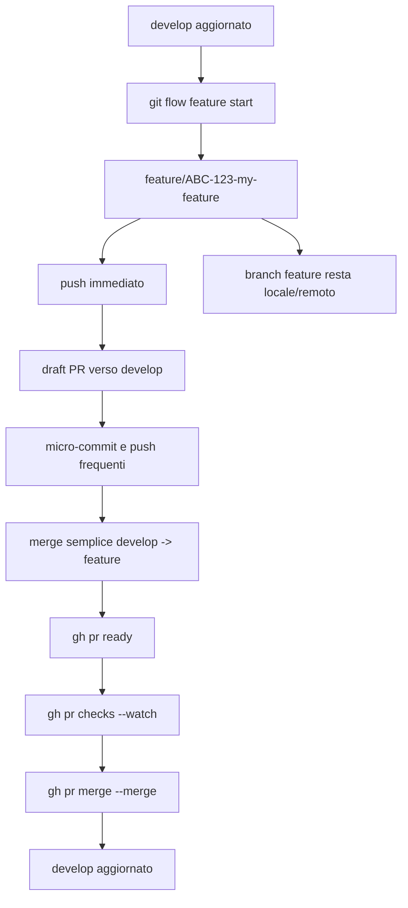
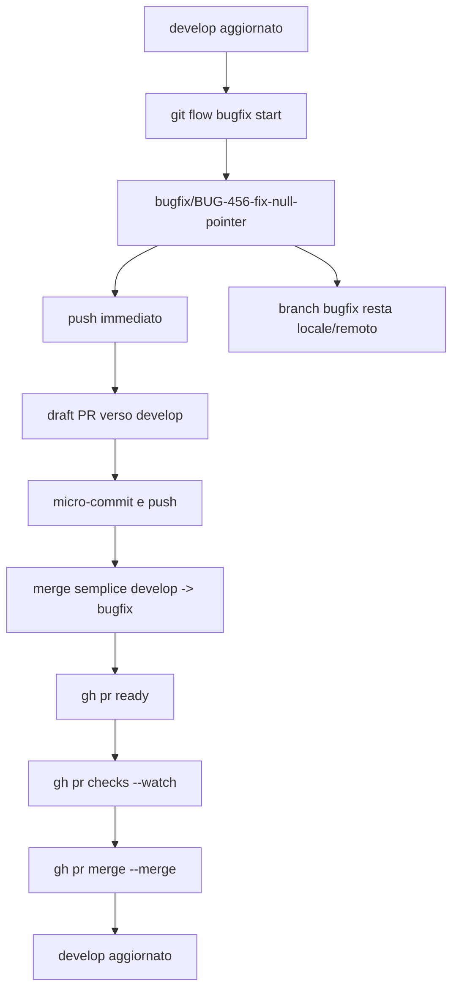
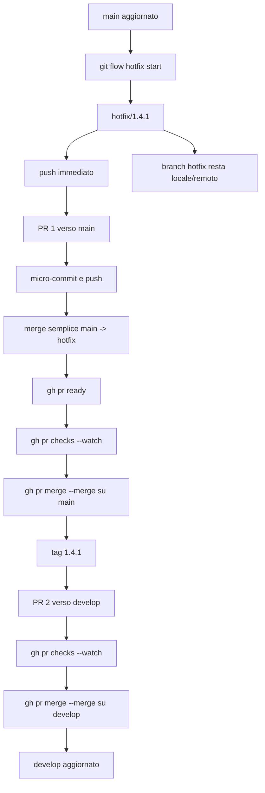
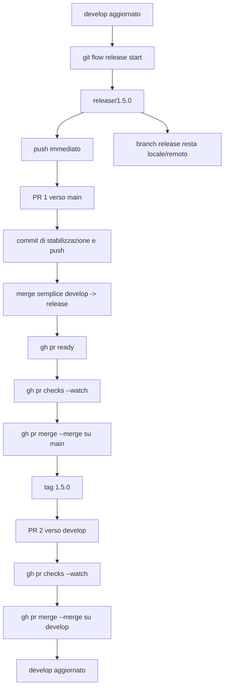
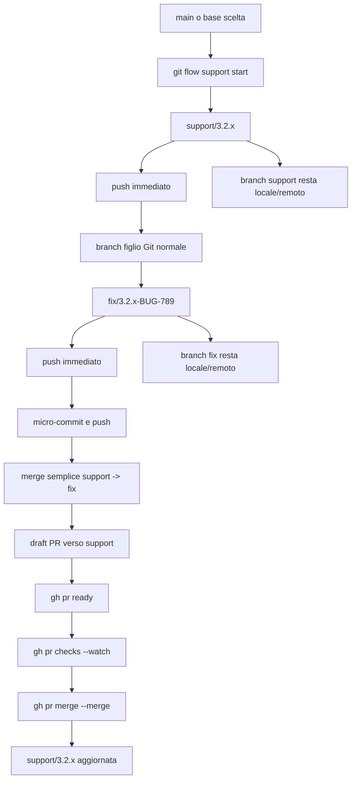

# Git Flow PR-Only Workflow (Terminal-Only, No Rebase, No Branch Deletion)

> Documento operativo per un workflow **PR-only**, **terminal-only**, con **merge semplice della branch base dentro il branch di lavoro prima della PR**, **nessun rebase** e **nessuna cancellazione dei branch**.

---

## Indice

- [1. Obiettivo e assunzioni](#1-obiettivo-e-assunzioni)
- [2. Installazione strumenti](#2-installazione-strumenti)
  - [2.1 Ubuntu 24.04](#21-ubuntu-2404)
  - [2.2 Rocky Linux 10](#22-rocky-linux-10)
  - [2.3 Verifica installazione e login GitHub CLI](#23-verifica-installazione-e-login-github-cli)
- [3. Regole globali del workflow](#3-regole-globali-del-workflow)
- [4. Regola comune di sincronizzazione prima della PR](#4-regola-comune-di-sincronizzazione-prima-della-pr)
- [5. Flow: Feature](#5-flow-feature)
- [6. Flow: Bugfix](#6-flow-bugfix)
- [7. Flow: Hotfix](#7-flow-hotfix)
- [8. Flow: Release](#8-flow-release)
- [9. Flow: Support](#9-flow-support)
- [10. Sintesi operativa finale](#10-sintesi-operativa-finale)
- [11. Riferimenti](#11-riferimenti)

---

## 1. Obiettivo e assunzioni

Perfetto. Te lo formalizzo in un workflow **PR-only, terminal-only, no rebase, no branch deletion**, coerente con i tuoi vincoli.

Assumo:

- `main` come branch di produzione
- `develop` come branch di integrazione

Se nel repository la branch di produzione si chiama ancora `master`, sostituisci semplicemente `main` con `master`.

In **AVH Edition** i “tipi” operativi rilevanti sono:

- `feature`
- `bugfix`
- `release`
- `hotfix`
- `support`

Gli altri sottocomandi (`init`, `config`, `log`, `version`) sono utility, non famiglie di branch. [^1]

La regola globale del processo è questa:

> **usi `git-flow` per aprire il branch giusto, fai push immediato, micro-commit e push frequenti, integri la branch base con un merge semplice prima della PR, poi fai il merge della PR dal terminale con `gh`, senza mai cancellare il branch**.

Questo implica, in pratica, che **non usi `git flow ... finish`** nel workflow quotidiano PR-only:

- per `feature`, `release` e `hotfix` la documentazione classica mostra che `finish` mergea localmente e poi rimuove il branch locale; [^2] [^8] [^9]
- `gh pr merge` ha inoltre un flag esplicito `--delete-branch`, che in questo processo **non va usato**. [^6]

Se su GitHub è attiva l’opzione **Automatically delete head branches**, va disattivata a livello repository. [^12]

La scelta è:

> **niente rebase prima della PR; solo merge della base dentro il branch di lavoro**.

Questo non è il default esemplificato dalla documentazione `git-flow` per le feature, che mostra `rebase`, ma è assolutamente realizzabile con Git standard tramite `git merge`. Per le release, la documentazione classica mostra esplicitamente proprio `git merge develop` come caso semplice di riallineamento della release branch. [^2] [^3] [^9]

> **Assunzione operativa aggiuntiva**
>
> Questo documento assume che sul repository GitHub sia abilitato il **merge commit** per le pull request, perché i comandi di merge qui sotto usano `gh pr merge --merge`. La GitHub CLI supporta `--merge`, `--rebase` e `--squash`; qui si usa volutamente `--merge` perché hai richiesto un flusso basato su merge semplici e non su rebase/squash. [^6]

---

## 2. Installazione strumenti

Gli strumenti minimi necessari sono:

- `git`
- `git-flow` (AVH Edition / pacchetto `git-flow` dove disponibile)
- `gh` (GitHub CLI)

---

### 2.1 Ubuntu 24.04

Su Ubuntu 24.04 (`noble`) i pacchetti `git`, `git-flow` e `gh` sono disponibili nel repository Ubuntu. [^13] [^14] [^15]

#### Installazione

```bash
# Aggiorna l'indice dei pacchetti APT per avere metadata correnti del repository.
sudo apt update

# Installa Git, necessario per tutte le operazioni di versionamento.
sudo apt install -y git

# Installa git-flow dal repository Ubuntu 24.04.
# Serve per i comandi "git flow feature|bugfix|release|hotfix|support ...".
sudo apt install -y git-flow

# Installa GitHub CLI dal repository Ubuntu 24.04.
# Serve per creare, ispezionare e mergiare PR da terminale.
sudo apt install -y gh
```

#### Perché ogni comando viene eseguito

- `sudo apt update`  
  Serve ad aggiornare l’indice locale dei pacchetti APT. Senza questo passaggio rischi di installare con metadata obsoleti o di non vedere versioni disponibili nel repository.

- `sudo apt install -y git`  
  Installa Git, base indispensabile del workflow.

- `sudo apt install -y git-flow`  
  Installa l’estensione `git-flow`, che in Ubuntu 24.04 è pubblicata come pacchetto `git-flow`. [^14]

- `sudo apt install -y gh`  
  Installa la GitHub CLI, che in Ubuntu 24.04 è pubblicata come pacchetto `gh`. [^15]

#### Note operative

- Se vuoi attenerti **strettamente** al pacchetto della distribuzione, i comandi sopra bastano.
- Se invece volessi sempre la build più recente di `gh`, puoi usare anche il repository ufficiale GitHub CLI; in questo documento però manteniamo il percorso più lineare e nativo per Ubuntu 24.04, dato che `gh` è già presente nel repository Ubuntu. [^15]

---

### 2.2 Rocky Linux 10

Su Rocky Linux 10 il package manager standard è `dnf`. [^16]  
Per `gh`, la documentazione Rocky mostra l’installazione aggiungendo il repository ufficiale GitHub CLI e poi usando `dnf install gh`. [^17]

Per `git-flow`, la strada più affidabile e coerente con AVH Edition, in assenza di un pacchetto Rocky esplicitamente documentato qui, è installarlo dall’upstream AVH con `make install`, che è il metodo documentato nel repository AVH. [^18]

#### Installazione

```bash
# Aggiorna i metadata dei repository DNF.
sudo dnf makecache

# Installa Git, Make e Curl.
# - git serve per il versionamento e per clonare il repository di git-flow AVH
# - make serve per "make install"
# - curl serve per scaricare/mettere in piedi il repository di gh
sudo dnf install -y git make curl
```

```bash
# Aggiunge il repository RPM ufficiale di GitHub CLI alla configurazione DNF.
# In questo modo Rocky saprà da dove scaricare il pacchetto "gh".
curl -fsSL https://cli.github.com/packages/rpm/gh-cli.repo | sudo tee /etc/yum.repos.d/github-cli.repo > /dev/null

# Installa la GitHub CLI dal repository ufficiale appena configurato.
sudo dnf install -y gh
```

```bash
# Clona il repository AVH Edition di git-flow in locale.
git clone https://github.com/petervanderdoes/gitflow-avh.git

# Entra nella directory del repository appena clonato.
cd gitflow-avh

# Installa git-flow nel sistema usando il target Makefile previsto dal progetto.
sudo make install

# Torna alla directory precedente.
cd ..
```

```bash
# Opzionale: rimuove la copia locale del repository usata solo per l'installazione.
rm -rf gitflow-avh
```

#### Perché ogni comando viene eseguito

- `sudo dnf makecache`  
  Aggiorna la cache dei repository DNF, equivalente concettuale di `apt update`.

- `sudo dnf install -y git make curl`  
  Installa:
  - `git`, per il versionamento e per clonare l’upstream AVH;
  - `make`, necessario per `make install`;
  - `curl`, usato per configurare il repository di `gh`.

- `curl -fsSL https://cli.github.com/packages/rpm/gh-cli.repo | sudo tee /etc/yum.repos.d/github-cli.repo > /dev/null`  
  Scrive il file di repository RPM ufficiale di GitHub CLI sotto `/etc/yum.repos.d/`, così `dnf` può installare `gh` dal repository corretto. La procedura corrisponde a quella documentata da Rocky Linux. [^17]

- `sudo dnf install -y gh`  
  Installa GitHub CLI.

- `git clone https://github.com/petervanderdoes/gitflow-avh.git`  
  Clona il repository AVH Edition.

- `cd gitflow-avh`  
  Entra nella directory del progetto perché `make install` va eseguito lì.

- `sudo make install`  
  Installa gli script `git-flow` nel sistema. Il repository AVH documenta esplicitamente `make && make install` come metodo di installazione. [^18]

- `cd ..`  
  Torna indietro dopo l’installazione.

- `rm -rf gitflow-avh`  
  Rimuove la copia locale del sorgente se non vuoi conservarla. È opzionale.

---

### 2.3 Verifica installazione e login GitHub CLI

Dopo l’installazione, conviene verificare subito che gli strumenti siano presenti e autenticare `gh`.

```bash
# Verifica che Git sia installato e mostra la versione.
git --version

# Verifica che git-flow sia installato.
git flow version || git flow init -h

# Verifica che GitHub CLI sia installato e mostra la versione.
gh --version
```

```bash
# Avvia il login interattivo di GitHub CLI.
# Serve per autorizzare i comandi PR/issue/repo da terminale.
gh auth login
```

#### Perché ogni comando viene eseguito

- `git --version`  
  Verifica immediata che `git` sia raggiungibile nel `PATH`.

- `git flow version || git flow init -h`  
  A seconda della build/installazione, il supporto di `git flow version` può non essere uniforme; il fallback `git flow init -h` serve semplicemente a verificare che il comando `git flow` esista e risponda.

- `gh --version`  
  Verifica la presenza di `gh`.

- `gh auth login`  
  La GitHub CLI documenta `gh auth login` come comando standard di autenticazione. [^19]

---

## 3. Regole globali del workflow

Le invarianti di questo processo sono:

- push immediato del branch appena creato;
- micro-commit e push frequenti;
- **mai rebase** prima della PR;
- **sempre merge semplice della base dentro il branch di lavoro**;
- merge PR dal terminale con `gh`;
- **mai cancellare i branch**.

### Comandi vietati in questo workflow

```bash
# NON usare "finish" nei branch topic del workflow quotidiano PR-only:
# - feature finish
# - bugfix finish
# - hotfix finish
# - release finish
# perché questi comandi appartengono al flusso git-flow classico, non al tuo flusso PR-only.
git flow feature finish <name>
git flow bugfix finish <name>
git flow hotfix finish <release>
git flow release finish <release>

# NON usare il flag che cancella automaticamente branch locale e remoto dopo il merge.
gh pr merge --delete-branch
```

### Perché questi comandi sono vietati

- `git flow ... finish`  
  Nel flusso classico, `finish` esegue merge locali e cleanup del branch; questo è in conflitto con il requisito “i branch devono rimanere sempre”. [^2] [^8] [^9]

- `gh pr merge --delete-branch`  
  Elimina il branch locale e remoto dopo il merge. È esplicitamente contrario alla regola del processo. [^6]

### Impostazione GitHub da verificare

Se non vuoi che GitHub cancelli automaticamente il branch head dopo il merge della PR:

1. apri il repository su GitHub;
2. vai in **Settings**;
3. sezione **Pull Requests**;
4. disattiva **Automatically delete head branches**. [^12]

---

## 4. Regola comune di sincronizzazione prima della PR

Per ogni branch “topic” che targetta una base, il pre-PR nel tuo processo è sempre questo:

1. aggiorni la base;
2. torni sul branch di lavoro;
3. fai un **merge semplice** della base dentro il branch;
4. risolvi eventuali conflitti;
5. fai push.

`git merge` è il comando Git standard per questo passaggio. [^3]

```bash
# Vai sulla branch base, cioè quella verso cui aprirai la PR.
git checkout <base>

# Allinea la branch base locale al remoto usando solo fast-forward.
# Questo evita di creare merge commit locali mentre stai solo sincronizzando.
git pull --ff-only origin <base>

# Torna sul branch di lavoro (feature/bugfix/hotfix/release/support-child).
git checkout <topic-branch>

# Esegue il merge della base aggiornata dentro il branch di lavoro.
# Questo è il punto chiave del tuo workflow: NO rebase, SI merge semplice.
git merge <base>

# Pubblica il risultato del merge sul remoto.
git push
```

### Perché ogni comando viene eseguito

- `git checkout <base>`  
  Serve a posizionarti sul branch di riferimento corretto.

- `git pull --ff-only origin <base>`  
  Aggiorna il branch base senza introdurre merge commit artificiali.

- `git checkout <topic-branch>`  
  Torna sul branch di lavoro.

- `git merge <base>`  
  Integra nel branch di lavoro l’ultima versione della base. Questo è il comportamento richiesto dal processo.

- `git push`  
  Pubblica il merge sul remoto, così la PR riflette esattamente lo stato corrente del branch.

---

## 5. Flow: Feature

In AVH, `feature` nasce da `develop` per default tramite `git flow feature start <name> [<base>]`. Nel workflow classico, `feature finish` mergea in `develop` e cancella il branch; nel tuo processo invece la chiusura avviene **solo via PR**. [^4]

### Flusso completo

```bash
# Vai su develop perché una feature nasce dalla branch di integrazione.
git checkout develop

# Aggiorna develop dal remoto prima di aprire un nuovo branch feature.
git pull --ff-only origin develop

# Crea il branch feature a partire da develop.
# Con AVH il nome reale sarà feature/ABC-123-my-feature.
git flow feature start ABC-123-my-feature

# Pubblica subito il branch remoto e imposta l'upstream tracking.
# Questo soddisfa il requisito "creo il ramo feature, già subito faccio il push".
git push -u origin feature/ABC-123-my-feature
```

### Perché ogni comando viene eseguito

- `git checkout develop`  
  Perché la base naturale di una feature è `develop`.

- `git pull --ff-only origin develop`  
  Per partire da uno stato allineato al remoto.

- `git flow feature start ABC-123-my-feature`  
  Per creare in modo coerente il branch `feature/...` usando la convenzione git-flow AVH. [^4]

- `git push -u origin feature/ABC-123-my-feature`  
  Per pubblicare subito il branch e configurare il tracking remoto.

### Draft PR immediata se la feature è lunga

Se la feature è lunga, apri subito una **draft PR** dal terminale; `gh pr create` supporta `--base`, `--head`, `--draft` e `--fill`, mentre `gh pr ready` la marca poi come pronta per la review. [^5] [^20]

```bash
# Crea una pull request draft verso develop.
# --base develop  => target della PR
# --head feature/... => branch sorgente della PR
# --draft         => la PR nasce come draft
# --fill          => usa commit/title/body disponibili per precompilare
gh pr create \
  --base develop \
  --head feature/ABC-123-my-feature \
  --draft \
  --fill
```

### Lavoro quotidiano

```bash
# Aggiunge tutte le modifiche correnti all'index.
git add -A

# Crea un micro-commit locale con un messaggio descrittivo.
git commit -m "Implement X"

# Pubblica subito il commit sul remoto.
# Questo è coerente con il requisito "micro commit e push almeno a fine giornata".
git push
```

### Riallineamento prima della review/PR finale

Prima della review/PR finale, nel tuo processo fai **merge semplice `develop -> feature/...`**, non rebase. [^3]

```bash
# Torna su develop per aggiornare la base.
git checkout develop

# Aggiorna la base develop dal remoto.
git pull --ff-only origin develop

# Torna sul branch feature che vuoi portare in review.
git checkout feature/ABC-123-my-feature

# Esegue il merge di develop dentro feature.
# Questo è il comportamento richiesto dal tuo processo: NO rebase, SI merge semplice.
git merge develop

# Pubblica il merge sul remoto così la PR include anche l'ultimo riallineamento.
git push
```

### Quando la feature è pronta

```bash
# Marca la draft PR come pronta per la review.
gh pr ready

# Mostra la PR corrente con i commenti.
# Utile per leggere review, thread e stato generale senza uscire dal terminale.
gh pr view --comments

# Monitora i check CI della PR corrente fino al completamento.
gh pr checks --watch

# Esegue il merge server-side con merge commit.
# NON usare --delete-branch.
gh pr merge --merge
```

`gh pr checks --watch` monitora i check CI fino al completamento; `gh pr merge --merge` esegue un merge commit server-side. Non usare `--delete-branch`. [^6] [^21]

### Dopo il merge

```bash
# Torna su develop dopo che la PR è stata mergiata.
git checkout develop

# Aggiorna il develop locale con quanto appena mergiato lato server.
git pull --ff-only origin develop
```

E **fine**. La branch `feature/...` resta sia locale sia remota.

### Schema Mermaid



---

## 6. Flow: Bugfix

In AVH, `bugfix` è una famiglia separata da `feature`; `git flow bugfix start <name> [<base>]` parte di default da `develop`. Anche qui AVH espone un comando `finish`, ma nel tuo processo lo ignori e chiudi tutto via PR. [^7]

### Flusso completo

```bash
# Vai su develop perché, in questo processo, anche il bugfix standard parte dalla branch di integrazione.
git checkout develop

# Aggiorna develop dal remoto.
git pull --ff-only origin develop

# Crea il branch bugfix a partire da develop.
git flow bugfix start BUG-456-fix-null-pointer

# Pubblica subito il branch remoto e imposta l'upstream tracking.
git push -u origin bugfix/BUG-456-fix-null-pointer
```

### Se il bugfix è lungo o vuoi review anticipata

```bash
# Crea una PR draft del bugfix verso develop.
gh pr create \
  --base develop \
  --head bugfix/BUG-456-fix-null-pointer \
  --draft \
  --fill
```

### Lavoro quotidiano

```bash
# Stage di tutte le modifiche correnti.
git add -A

# Commit atomico della correzione o di una sua parte.
git commit -m "Fix null dereference in parser"

# Push del commit al remoto.
git push
```

### Prima della PR: merge semplice della base

```bash
# Aggiorna la branch base develop.
git checkout develop
git pull --ff-only origin develop

# Torna sul bugfix.
git checkout bugfix/BUG-456-fix-null-pointer

# Integra l'ultimo develop dentro il branch bugfix.
git merge develop

# Pubblica il merge sul remoto.
git push
```

### Chiusura

```bash
# Marca la PR come pronta per la review.
gh pr ready

# Visualizza la PR con i commenti.
gh pr view --comments

# Osserva i check CI fino alla fine.
gh pr checks --watch

# Esegue il merge commit della PR.
gh pr merge --merge
```

### Post-merge

```bash
# Torna su develop dopo il merge della PR.
git checkout develop

# Sincronizza il develop locale con il remoto.
git pull --ff-only origin develop
```

Operativamente, nel tuo processo `bugfix` è uguale a `feature`; cambia solo la semantica del branch name e il fatto che AVH la distingue nativamente. [^7]

### Schema Mermaid



---

## 7. Flow: Hotfix

La doc classica `git-flow` definisce `hotfix` come branch per correggere rapidamente la **ultima release stabile**; nasce dalla branch di produzione (`master` nella doc classica, da leggere come la tua `main` se l’hai configurata così) e, nel flusso classico, `hotfix finish` mergea sia nella branch di produzione sia in `develop`, crea il tag e poi rimuove il branch locale. In un workflow PR-only, la traduzione naturale è: **stesso branch, due PR, più tag esplicito**. [^8]

### Flusso completo

```bash
# Vai su main perché l'hotfix nasce dalla branch di produzione.
git checkout main

# Aggiorna main dal remoto prima di creare l'hotfix.
git pull --ff-only origin main

# Crea il branch hotfix a partire da main.
git flow hotfix start 1.4.1

# Pubblica subito il branch remoto e imposta l'upstream tracking.
git push -u origin hotfix/1.4.1
```

### Lavoro quotidiano

```bash
# Stage di tutte le modifiche.
git add -A

# Commit della correzione urgente di produzione.
git commit -m "Fix production regression in payment flow"

# Push del commit al remoto.
git push
```

### Se `main` si è mossa: merge semplice `main -> hotfix`

La doc classica mostra rename + rebase; dato che tu hai escluso il rebase, qui standardizziamo un **merge semplice `main -> hotfix/...`** prima della PR. È una personalizzazione del workflow, ma perfettamente compatibile con Git. [^3] [^8]

```bash
# Aggiorna main dal remoto.
git checkout main
git pull --ff-only origin main

# Torna sul branch hotfix.
git checkout hotfix/1.4.1

# Integra l'ultimo main dentro l'hotfix con merge semplice.
git merge main

# Pubblica il merge sul remoto.
git push
```

### PR 1: hotfix verso produzione

```bash
# Crea una PR draft dell'hotfix verso main.
gh pr create \
  --base main \
  --head hotfix/1.4.1 \
  --draft \
  --fill
```

Quando pronta:

```bash
# Marca la PR verso main come pronta.
gh pr ready

# Attende il completamento dei check CI.
gh pr checks --watch

# Esegue il merge commit della PR verso main.
gh pr merge --merge
```

### Tag della release hotfix

Nel flusso classico, `hotfix finish` crea anche il tag della versione; in PR-only il punto più pulito è creare il tag **dopo** che la PR verso `main` è stata mergiata. [^8]

```bash
# Torna su main dopo che la PR verso produzione è stata mergiata.
git checkout main

# Aggiorna il main locale per assicurarti di taggare il commit corretto.
git pull --ff-only origin main

# Crea un tag annotato della versione hotfix.
git tag -a 1.4.1 -m "Hotfix 1.4.1"

# Pubblica il tag sul remoto.
git push origin 1.4.1
```

### PR 2: stesso hotfix verso `develop`

Poiché il flusso classico di `hotfix finish` porta le modifiche sia in produzione sia in `develop`, in PR-only fai una seconda PR dal medesimo branch hotfix verso `develop`. [^8]

```bash
# Crea la seconda PR dello stesso branch hotfix, questa volta verso develop.
gh pr create \
  --base develop \
  --head hotfix/1.4.1 \
  --fill
```

```bash
# Attende i check CI della PR verso develop.
gh pr checks --watch

# Mergia la PR verso develop.
gh pr merge --merge
```

Infine:

```bash
# Torna su develop dopo che anche la seconda PR è stata mergiata.
git checkout develop

# Aggiorna il develop locale con il merge appena avvenuto lato server.
git pull --ff-only origin develop
```

Nel tuo processo, quindi, l’hotfix è: **start da `main`, push immediato, merge `main -> hotfix` prima della PR se serve, PR su `main`, tag, PR su `develop`, nessuna cancellazione**.

### Schema Mermaid



---

## 8. Flow: Release

La doc classica dice che `release` nasce da `develop`, serve per preparare una nuova versione maggiore/minore, e `release finish` fa quattro cose: merge in produzione, crea il tag, merge in `develop`, rimuove il branch locale. Anche qui, in PR-only, la forma corretta è **due PR + tag manuale**, senza usare `finish`. La stessa doc dice anche che la release branch dovrebbe essere abbastanza breve e leggera, e mostra `git merge develop` come caso semplice per aggiornarla. [^9]

### Flusso completo

```bash
# Vai su develop perché una release nasce dalla branch di integrazione.
git checkout develop

# Aggiorna develop dal remoto.
git pull --ff-only origin develop

# Crea il branch release a partire da develop.
git flow release start 1.5.0

# Pubblica subito il branch remoto e imposta l'upstream tracking.
git push -u origin release/1.5.0
```

### Lavoro tipico in release

```bash
# Stage delle modifiche di stabilizzazione release.
git add -A

# Commit tipico di release, per esempio bump di versione.
git commit -m "Bump version to 1.5.0"

# Pubblica il commit sul remoto.
git push
```

### Se durante la stabilizzazione vuoi riallinearla a `develop` senza rebase

Il pre-PR standard è compatibile anche qui; in più, per la release, la doc classica mostra esplicitamente `git merge develop` come caso semplice. [^9]

```bash
# Aggiorna develop dal remoto.
git checkout develop
git pull --ff-only origin develop

# Torna sul branch release.
git checkout release/1.5.0

# Integra l'ultimo develop dentro la release con merge semplice.
git merge develop

# Pubblica il merge sul remoto.
git push
```

### PR 1: release verso produzione

```bash
# Crea una PR draft della release verso main.
gh pr create \
  --base main \
  --head release/1.5.0 \
  --draft \
  --fill
```

Quando pronta:

```bash
# Marca la PR release->main come pronta per la review.
gh pr ready

# Attende la fine dei check CI.
gh pr checks --watch

# Esegue il merge commit della PR verso main.
gh pr merge --merge
```

### Tag della release

Nel flusso classico `release finish` crea il tag della versione. In PR-only, farlo subito dopo il merge della PR verso `main` è il punto più pulito. [^9]

```bash
# Torna su main dopo il merge della PR di release.
git checkout main

# Aggiorna il main locale così il tag punta al commit corretto già presente sul server.
git pull --ff-only origin main

# Crea il tag annotato della release.
git tag -a 1.5.0 -m "Release 1.5.0"

# Pubblica il tag sul remoto.
git push origin 1.5.0
```

### PR 2: stessa release verso `develop`

Poiché il flusso classico porta anche la release in `develop`, apri una seconda PR dal medesimo branch release verso `develop`. [^9]

```bash
# Crea una seconda PR dello stesso branch release verso develop.
gh pr create \
  --base develop \
  --head release/1.5.0 \
  --fill
```

```bash
# Attende i check CI della PR verso develop.
gh pr checks --watch

# Esegue il merge commit della PR verso develop.
gh pr merge --merge
```

Infine:

```bash
# Torna su develop dopo il merge della seconda PR.
git checkout develop

# Aggiorna il develop locale.
git pull --ff-only origin develop
```

Quindi, per te, la release è: **start da `develop`, push immediato, piccoli commit di stabilizzazione, merge `develop -> release` se serve, PR su `main`, tag, PR su `develop`, nessuna cancellazione**.

### Schema Mermaid



---

## 9. Flow: Support

Sì: **c’è anche `support`**. Però qui va fatta una precisazione importante: nella AVH Edition pubblica, `support` è la parte più incompleta/meno rifinita. Le issue pubbliche mostrano che `git flow support start` richiede esplicitamente `<version> <base>`, che non esiste un `support publish`, e che non esiste un `support finish` analogo a `hotfix finish`. Per questo, nella pratica, io lo userei **solo per creare la maintenance line**, e poi userei **Git normale** per i branch figli targettati a quella line. [^10] [^11]

### Cosa rappresenta

`support/3.2.x` o simili è una **linea di manutenzione long-lived** per una vecchia major/minor/LTS.

### Apertura della support line

```bash
# Vai su main (o sulla base corretta che deve originare la support line).
git checkout main

# Aggiorna la branch base dal remoto.
git pull --ff-only origin main

# Crea la support line.
# ATTENZIONE: support richiede esplicitamente <release> e <base>.
git flow support start 3.2.x <base>

# Pubblica subito la support line sul remoto.
git push -u origin support/3.2.x
```

Sul fatto che `support start` richieda un `<base>` esplicito, la traccia pubblica è chiara; inoltre una issue pubblica mostra che `support publish` non esiste, quindi il push lo fai con Git normale. [^10]

### Come lavorarci davvero

Qui non insisterei con `git flow` per i branch figli. Tratterei `support/3.2.x` come un trunk di manutenzione, e aprirei branch normali Git sopra di lui:

```bash
# Vai sulla support line.
git checkout support/3.2.x

# Aggiorna la support line dal remoto.
git pull --ff-only origin support/3.2.x

# Crea un branch figlio normale Git sopra la support line.
git switch -c fix/3.2.x-BUG-789

# Pubblica subito il branch remoto figlio.
git push -u origin fix/3.2.x-BUG-789
```

### Lavoro quotidiano

```bash
# Stage delle modifiche sul fix branch della support line.
git add -A

# Commit della correzione.
git commit -m "Fix issue on 3.2.x line"

# Push del commit sul remoto.
git push
```

### Prima della PR: merge semplice della base dentro il branch di lavoro

```bash
# Aggiorna la support line dal remoto.
git checkout support/3.2.x
git pull --ff-only origin support/3.2.x

# Torna sul branch figlio di lavoro.
git checkout fix/3.2.x-BUG-789

# Integra l'ultima support line dentro il branch di lavoro.
git merge support/3.2.x

# Pubblica il merge sul remoto.
git push
```

### PR verso la support line

```bash
# Crea una PR draft verso la support line.
gh pr create \
  --base support/3.2.x \
  --head fix/3.2.x-BUG-789 \
  --draft \
  --fill
```

```bash
# Marca la PR come pronta.
gh pr ready

# Monitora i check CI.
gh pr checks --watch

# Esegue il merge commit della PR verso support/3.2.x.
gh pr merge --merge
```

Questa è, realisticamente, la forma più robusta per `support` nel tuo processo, proprio perché la famiglia `support` in AVH non ha la stessa completezza operativa di `feature`/`bugfix`/`release`/`hotfix`. [^10] [^11]

### Schema Mermaid



---

## 10. Sintesi operativa finale

Per il tuo caso specifico, la normalizzazione corretta è questa:

- **feature**: `develop -> feature/... -> PR su develop`
- **bugfix**: `develop -> bugfix/... -> PR su develop`
- **hotfix**: `main -> hotfix/... -> PR su main -> tag -> PR su develop`
- **release**: `develop -> release/... -> PR su main -> tag -> PR su develop`
- **support**: `git flow support start ...`, poi branch figli con Git normale e PR verso `support/...` [^4]

E le tue invarianti restano sempre identiche:

- push immediato del branch appena creato;
- micro-commit + push almeno a fine giornata;
- **mai rebase** prima della PR;
- **sempre merge semplice della base dentro il branch di lavoro**;
- merge PR dal terminale con `gh`;
- **mai cancellare i branch**. [^5]

---

## 11. Riferimenti

[^1]: GitHub / `gitflow-avh` README e struttura comandi: https://github.com/petervanderdoes/gitflow-avh/blob/develop/README.md  
[^2]: Git Flow Documentation — Features: https://git-flow.readthedocs.io/en/latest/features.html  
[^3]: Git — `git merge` documentation: https://git-scm.com/docs/git-merge  
[^4]: GitHub / `git-flow-feature` (AVH): https://github.com/petervanderdoes/gitflow-avh/blob/develop/git-flow-feature  
[^5]: GitHub CLI — `gh pr create`: https://cli.github.com/manual/gh_pr_create  
[^6]: GitHub CLI — `gh pr merge`: https://cli.github.com/manual/gh_pr_merge  
[^7]: GitHub / `git-flow-bugfix` (AVH): https://github.com/petervanderdoes/gitflow-avh/blob/develop/git-flow-bugfix  
[^8]: Git Flow Documentation — Hotfix: https://git-flow.readthedocs.io/en/latest/hotfix.html  
[^9]: Git Flow Documentation — Releases: https://git-flow.readthedocs.io/en/latest/releases.html  
[^10]: GitHub issue — `git flow support start` / support branch limitations: https://github.com/petervanderdoes/gitflow-avh/issues/380  
[^11]: GitHub issue — no `support publish`: https://github.com/petervanderdoes/gitflow-avh/issues/356  
[^12]: GitHub Docs — Managing the automatic deletion of branches: https://docs.github.com/en/repositories/configuring-branches-and-merges-in-your-repository/configuring-pull-request-merges/managing-the-automatic-deletion-of-branches  
[^13]: Ubuntu 24.04 package `git`: https://packages.ubuntu.com/noble/git  
[^14]: Ubuntu 24.04 package `git-flow`: https://packages.ubuntu.com/noble/git-flow  
[^15]: Ubuntu 24.04 package `gh`: https://packages.ubuntu.com/noble/gh  
[^16]: Rocky Linux documentation — DNF package manager: https://docs.rockylinux.org/10/guides/package_management/dnf_package_manager/  
[^17]: Rocky Linux documentation — Installing and Setting Up GitHub CLI on Rocky Linux: https://docs.rockylinux.org/10/gemstones/git/00-gh_cli_installation/  
[^18]: AVH README — `make && make install`: https://github.com/petervanderdoes/gitflow-avh/blob/develop/README.md  
[^19]: GitHub CLI manual — authentication: https://cli.github.com/manual/index  
[^20]: GitHub CLI — `gh pr ready`: https://cli.github.com/manual/gh_pr_ready  
[^21]: GitHub CLI — `gh pr checks`: https://cli.github.com/manual/gh_pr_checks
